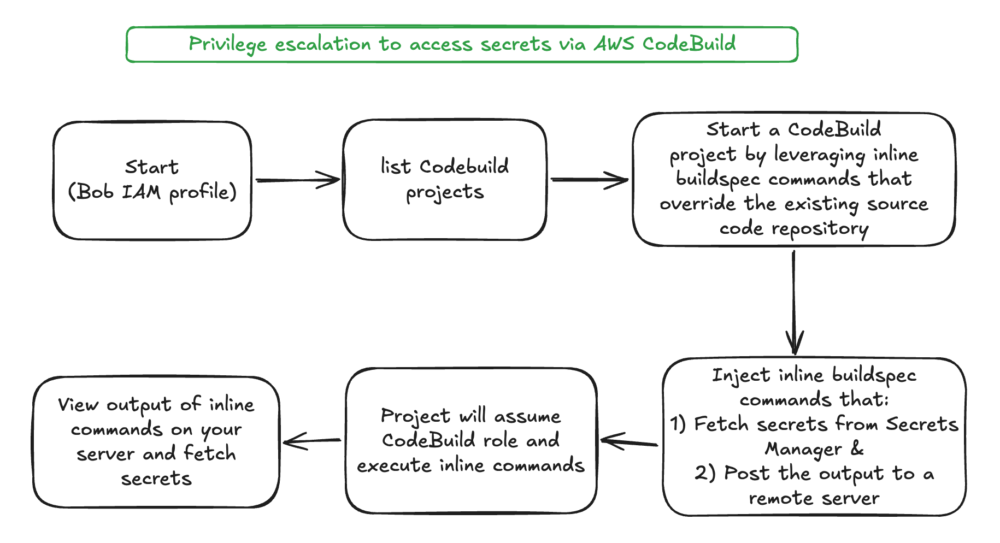

# Scenario: codebuild_buildspec_override

**Size:** Small

**Difficulty:** Medium

**Command:** `$ ./cloudgoat.py create codebuild_buildspec_override`

## Scenario Resources

- 1 IAM User (Bob, the low-privileged starting identity)
- 1 IAM Role (CodeBuild service role, the privileged identity assumed by the build)
- 2 IAM Policies (one attached to IAM user Bob, one attached to the service role)
- 1 CodeBuild Project (configured with a `SECRETS_MANAGER`-type environment variable that references the target secret by name)
- 1 Secrets Manager Secret

## Scenario Start(s)

1. IAM User "Bob", access key and secret key provided in `start.txt`

## Scenario Goal(s)

Retrieve the value of the secret stored in AWS Secrets Manager.

## Summary

Starting as the low-privileged IAM user Bob, the attacker discovers they have just enough permissions to list, inspect, and start CodeBuild projects. The existing CodeBuild project runs under a service role with read access to that one secret, a permission Bob himself does not have. Inspecting the project's configuration also discloses a `SECRETS_MANAGER`-type environment variable that references the exact name of the target secret, without exposing its value.

By starting a new build and overriding the buildspec with inline commands, the attacker hijacks the build execution context. The injected commands run as the CodeBuild service role and call `secretsmanager:GetSecretValue` for the secret name already learned during reconnaissance. The secret value is then exfiltrated by POSTing it to an attacker-controlled HTTP listener, completing the privilege escalation.

## Exploitation Route(s)

## Walkthrough - Bob

1. As the IAM user Bob, the attacker begins by enumerating available permissions. Direct calls to Secrets Manager or IAM are denied.

2. The attacker lists CodeBuild projects using `codebuild:ListProjects` and discovers a project named `cg-vulnerable-project-<cgid>`.

3. Using `codebuild:BatchGetProjects`, the attacker inspects the project's configuration and learns two things: its service role ARN, and the name of the target secret, disclosed through a `SECRETS_MANAGER`-type environment variable named `SECRET_NAME` (only the reference is visible here, not the secret's value). The attacker cannot assume the role or read the secret directly, but can trigger the role's permissions indirectly by starting a build.

4. The attacker starts a new build on the discovered project using `codebuild:StartBuild`. Crucially, they supply a `buildspecOverride` parameter containing inline shell commands instead of the repository's original buildspec.

5. The injected buildspec calls `secretsmanager:GetSecretValue` for the secret name already learned in Step 3, using the build's inherited role credentials, then POSTs the secret value as JSON to an attacker-controlled HTTP listener (e.g. `webhook.site`).

6. The CodeBuild project assumes its service role for the duration of the build. Because the service role has `secretsmanager:GetSecretValue` scoped to that exact secret, the injected command succeeds.

7. The attacker observes the secret value arrive at their listener, completing the scenario.

A cheat sheet for this route is available [here](./cheat_sheet.md).
